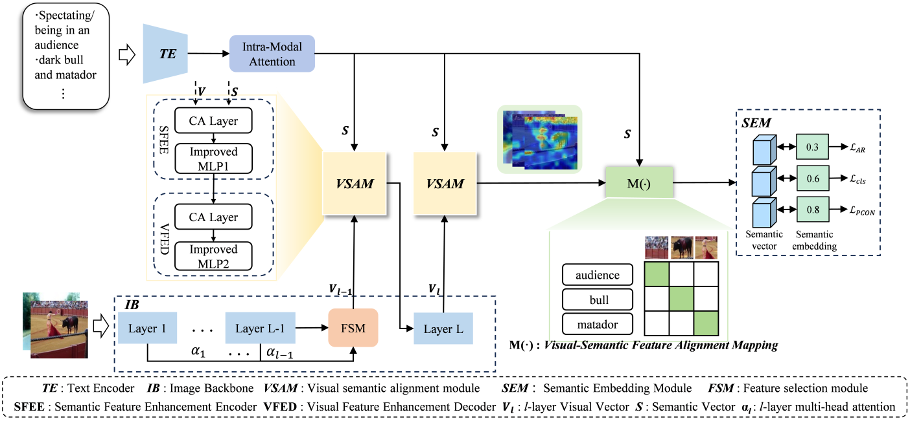

<p align="center">
  <h2 align="center">BiPAZSL: A Bidirectional Progressive Attention Method for Zero-Shot Learning Domain Shift Mitigation</h2>
  <p align="center">
    <a href=""><strong>Chong Li</strong></a>·
    <a href=""><strong>Jie Su</strong></a>·
    <a href=""><strong>Jinsong Gao</strong></a>
  </p>
  <h3 align="center">
  <a href="">Paper</a> | <a href="">Project Page</a></h3>
</p>

## 📣 News


## 📌 Overview

<p align="center">
  <a href="">
  </a>
  <p align="center"><strong></strong>BiPAZSL is a Zero-Shot Learning (ZSL) model designed to mitigate domain shift—a key challenge caused by the distribution gap between seen and unseen classes in visual-semantic space. It enhances cross-modal alignment and generalization (especially for complex scenes) via three core components: a hierarchical bidirectional progressive attention mechanism, a Feature Selection Module (FSM)-enhanced ViT, and a multi-loss fusion strategy.
  </p>
</p>

## 💾 Installation

### Requirements
- Linux with Python = 3.8
- PyTorch ≥ 2.0.0
- RTX4090

### Step-by-Step Setup
```shell
  # Clone the repository
  git clone https://github.com/SuJie-Med/BiPAZSL.git
  cd BiPAZSL
  
  # Create and activate conda environment
  conda create -n BiPAZSL python=3.8 -y
  conda activate BiPAZSL
  
  # Install dependencies
  pip install apex
  pip install -r requirements.txt
```

## 📊 Dataset Description
### Public Datasets
- <a href="https://groups.csail.mit.edu/vision/SUN/hierarchy.html"><strong>SUN</strong></a>
- <a href="https://www.vision.caltech.edu/datasets/cub_200_2011/"><strong>CUB</strong></a>
- <a href="https://cvml.ist.ac.at/AwA2/"><strong>AWA2</strong></a>

### Data split
- Datasets can be download from <a href="https://datasets.d2.mpi-inf.mpg.de/xian/xlsa17.zip"><strong>Xian et al. (CVPR2017)</strong></a> and take them into dir ../../datasets/
