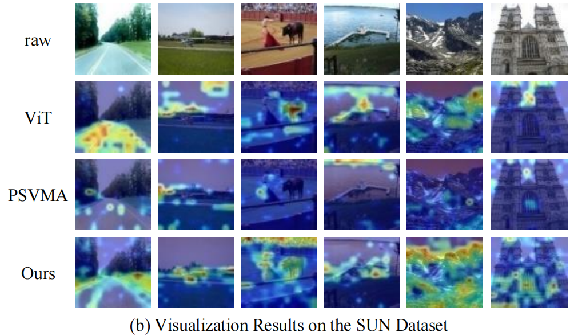
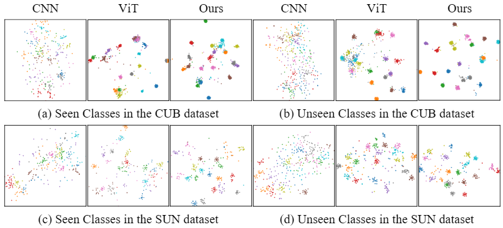

<p align="center">
  <h2 align="center">BiPAZSL: A Bidirectional Progressive Attention Method for Zero-Shot Learning Domain Shift Mitigation</h2>
  <p align="center">
    <a href="https://scholar.google.com/citations?user=-Kszis0AAAAJ&hl=zh-CN"><strong>Chong Li</strong></a>·
    <a href="https://scholar.google.com/citations?hl=zh-CN&user=qzC5ZiAAAAAJ"><strong>Jie Su</strong></a>·
    <a href=""><strong>Jinsong Gao</strong></a>
  </p>
  <h3 align="center">
  <a href="https://papers.ssrn.com/sol3/papers.cfm?abstract_id=5313355">Paper</a> | <a href="">Project Page</a></h3>
</p>

## 📣 News


## 📌 Overview

<p align="center">
  <a href="">
  </a>
  <p align="center"><strong></strong>BiPAZSL is a Zero-Shot Learning (ZSL) model designed to mitigate domain shift—a key challenge caused by the distribution gap between seen and unseen classes in visual-semantic space. It enhances cross-modal alignment and generalization (especially for complex scenes) via three core components: a hierarchical bidirectional progressive attention mechanism, a Feature Selection Module (FSM)-enhanced ViT, and a multi-loss fusion strategy.
  </p>
</p>

## 💾 Installation

### Requirements
- Linux with Python = 3.8
- PyTorch ≥ 2.0.0
- RTX4090

### Step-by-Step Setup
```shell
  # Clone the repository
  git clone https://github.com/SuJie-Med/BiPAZSL.git
  cd BiPAZSL
  
  # Create and activate conda environment
  conda create -n BiPAZSL python=3.8 -y
  conda activate BiPAZSL
  
  # Install dependencies
  pip install apex
  pip install -r requirements.txt
```

## 📊 Dataset Description
### Public Datasets
- <a href="https://groups.csail.mit.edu/vision/SUN/hierarchy.html"><strong>SUN</strong></a>
- <a href="https://www.vision.caltech.edu/datasets/cub_200_2011/"><strong>CUB</strong></a>
- <a href="https://cvml.ist.ac.at/AwA2/"><strong>AWA2</strong></a>

### Data split
- Datasets can be download from <a href="https://datasets.d2.mpi-inf.mpg.de/xian/xlsa17.zip"><strong>Xian et al.</strong></a> In order to train the BiPAZSL, you should firstly download these datasets as well as the xlsa17. Then decompress and organize them as follows:
```shell
.
├── data
│   ├── CUB/CUB_200_2011/...
│   ├── SUN/images/...
│   ├── AWA2/Animals_with_Attributes2/...
│   └── xlsa17/data/...
└── ···
```

## 🚀 Train & Eval

We provide our parameters setting of conventional ZSL (CZSL) and generalized ZSL (GZSL) tasks for CUB, SUN, and AWA2. You can run the following commands to train the BiPAZSL from scratch:

Preparation of Attribute w2v before training：
```shell
python extract_attribute_w2v_CUB.py
python extract_attribute_w2v_SUN.py
python extract_attribute_w2v_AWA2.py
```

Train:
```shell
bash train.sh > train.log 2>&1
```

Eval:
```shell
bash test.sh > test.log 2>&1
```

## ⚡Results

| Dataset | Acc(CZSL) | U(GZSL) | S(GZSL) | H(GZSL) |
|---------|-----------|---------|---------|---------|
| CUB     | 76.2      | 70.1    | 77.4    | 73.5    |
| SUN     | 71.2      | 61.4    | 48.6    | 54.2    |
| AWA2    | 73.8      | 68.4    | 87.7    | 76.8    |

### Visualization

```shell
bash gradcam1.sh
```

<a href=""></a>

t-SNE:

<a href=""></a>
